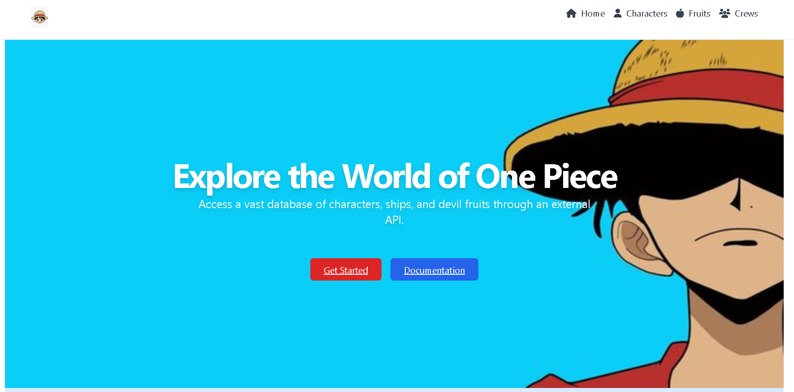
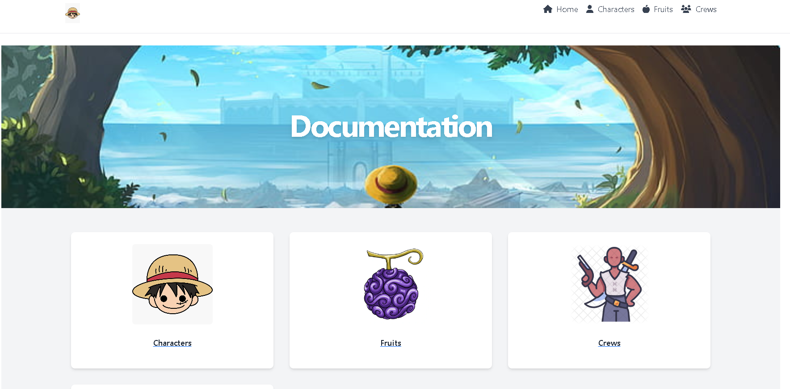
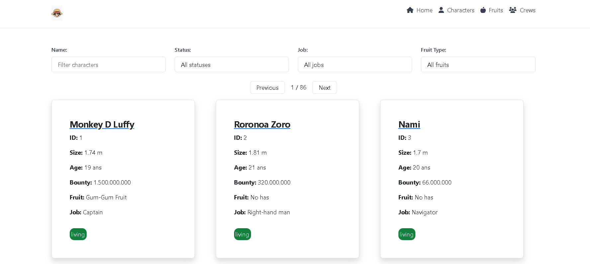
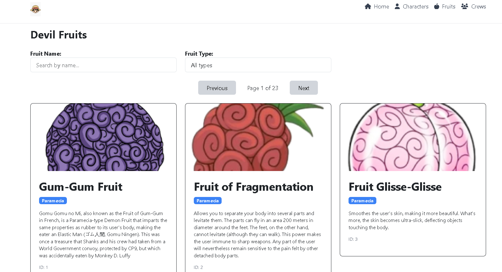
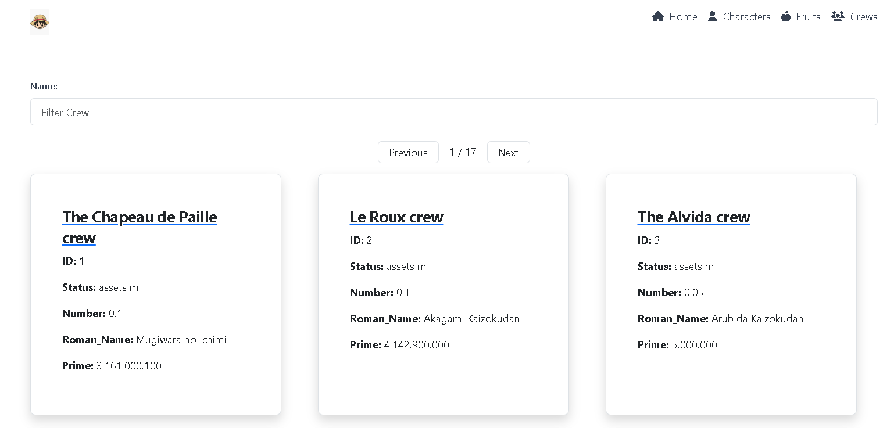

# OnePieceAngular

Este proyecto es una página web dedicada a **One Piece**, desarrollada con **Angular** y **Bootstrap**. La aplicación consume información de personajes, tripulaciones y frutas del diablo desde la API [https://api-onepiece.com/en](https://api-onepiece.com/en). 

> [!IMPORTANT]  
> No soy propietario de esta API ni tengo relación con sus creadores. Solo la utilizo para obtener y mostrar los datos en este proyecto.

### Home
En la página principal, encontrarás una breve introducción a la aplicación.

### Documentación
En la sección de documentación, puedes ver toda la información disponible de manera estructurada.

### Personajes
Aquí podrás visualizar detalles de los personajes del anime, como su nombre, edad, altura, recompensa, estado (si están vivos o no), entre otros datos. Al hacer clic en un personaje, accederás a más información detallada sobre el mismo.

### Frutas del Diablo
En esta sección podrás ver todas las **Frutas del Diablo** con sus nombres y descripciones. También puedes filtrar las frutas según sus tipos.

### Tripulaciones
Aquí podrás explorar los barcos y sus respectivas tripulaciones. Al hacer clic en un barco, verás los detalles de sus tripulantes.

